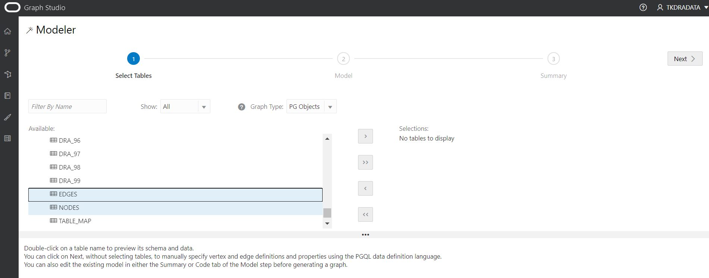
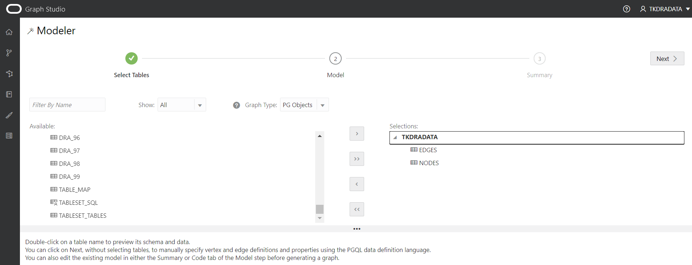
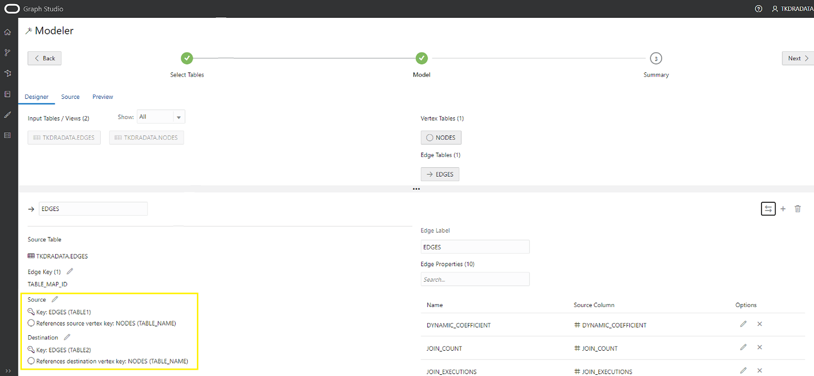
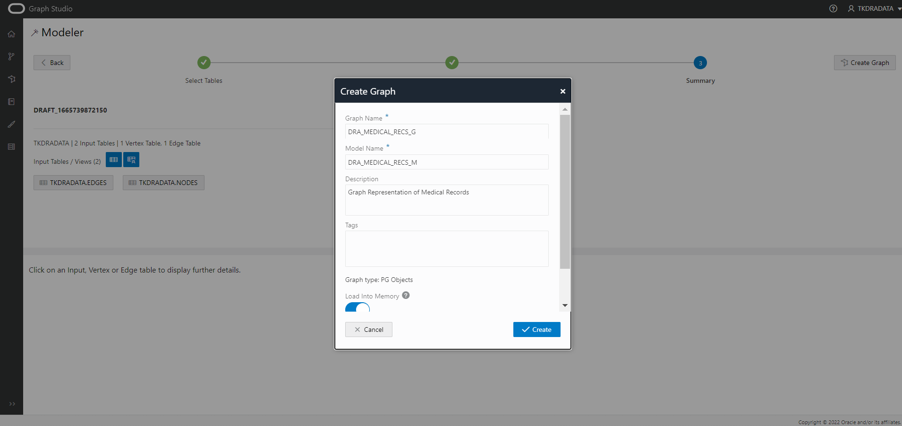
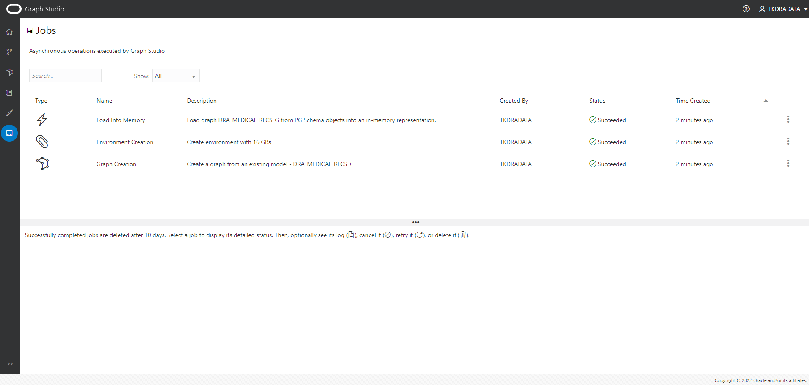

# Construct a graph using the collected data

## Introduction

In this lab, we will create the graph model from the data which are extracted from the previous labs for which tables and the affinity the between the tables are calculated.

Estimated Lab Time: 15 minutes

### Objectives

In this lab :

* Using the Graph Studio, we create a model and the graph from the tables created in Lab 2

### Prerequisites (Optional)

This lab assumes you have:

* An Oracle account
* This lab requires an Autonomous Database - Shared Infrastructure or Autonomous Transaction Processing - Shared Infrastructure account.

## Task 1: Connect to your Autonomous Database using Graph Studio

1. If you have the Graph Studio URL then proceed to step 4.

    Log in to the Oracle Cloud Console, choose the Autonomous Database instance, then Click the **Tools** tab on the details page menu on the left.

   

2. Click the **Open Graph Studio** card to open in a new page or tab in your browser.

   If your tenancy administrator provided you the Graph Studio URL to connect directly then use that instead.

3. Enter your Autonomous Database account credentials (for example, `TKDRADATA`) into the login screen:

    

4. Then click the **Sign In** button. You should see the studio home page.

    

## Task 2: Create a graph of nodes and edges from the corresponding tables

1. Click the **Models** icon to navigate to the start of the modeling workflow.  
   Then click **Create**.  
     

   >**Note: If you clicked on `Start Modeling` button instead then you'll see the screen shown in the next step.**

2. Then select the `NODES` and `EDGES` tables.

3. Move them to the right, that is, click the first icon on the shuttle control.

   

4. Click **Next** to get a suggested model. We will edit and update this model to add an edge and a vertex label.  

    The suggested model has the `NODES` as a vertex table since there are foreign key constraints specified on `EDGES` that reference it.

    And `EDGES` is a suggested edge table.

   
  
5. Since these are directed edges, a best practice is verifying that the direction is correct.  
    In this instance we want to **confirm** that the direction is from `table1` to `table2`.  

    Note the `Source Vertex` and `Destination Vertex` information on the left.  

      

    **Notice** that the direction is wrong. The Source Key is `table2` instead of what we want, which is `table1`.  

    Click the swap edge icon on the right to swap the source and destination vertices and hence reverse the edge direction.  

   Note that the `Source Vertex` is now the correct one, i.e. the `TABLE1`.

   

6. Click the **Source** tab to verify that the edge direction, and hence the generated CREATE PROPERTY GRAPH statement, is correct.

     
  
7. Click **Next** and then click **Create Graph** to move on to the next step in the flow.

   Enter `DRA_MEDICAL_RECS_G` as the graph name.  
   That graph name is used throughout the next lab.  
   Do not enter a different name because then the queries and code snippets in the next lab will fail.  

   Enter a model name (for example, `DRA_MEDICAL_RECS_M`), and other optional information.  
   

8. Graph Studio modeler will now save the metadata and start a job to create the graph.  
   The Jobs page shows the status of this job.

     

Once this has been completed you are ready to **proceed to the next lab**.

## Learn More

## Acknowledgements

* **Author** - Praveen Hiremath, Developer Advocate
* **Contributors** -  Praveen Hiremath, Developer Advocate
* **Last Updated By/Date** - Praveen Hiremath, Developer Advocate, October 2022
