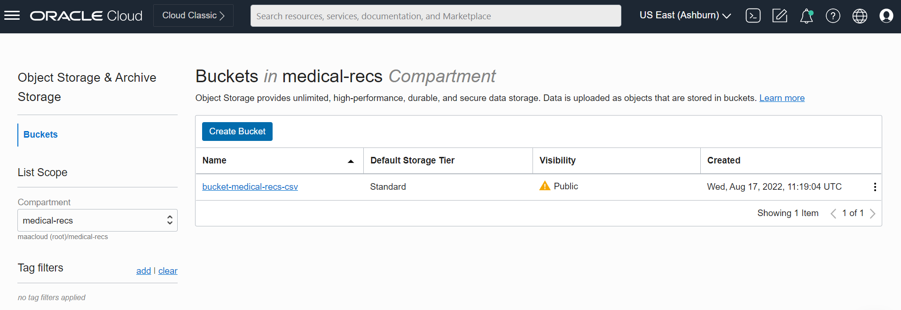
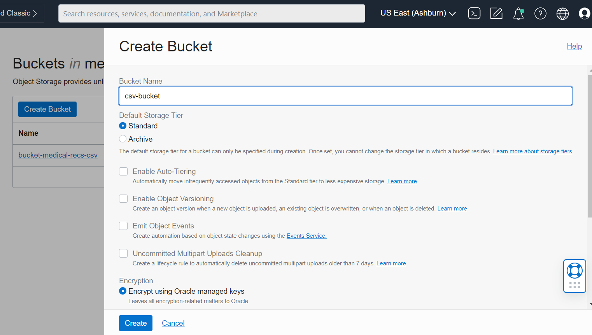
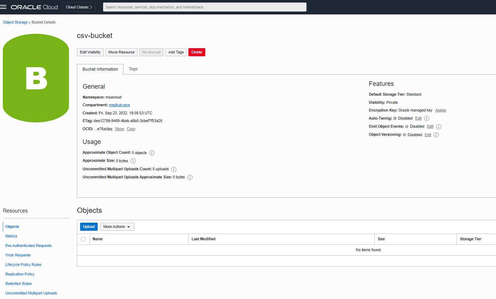
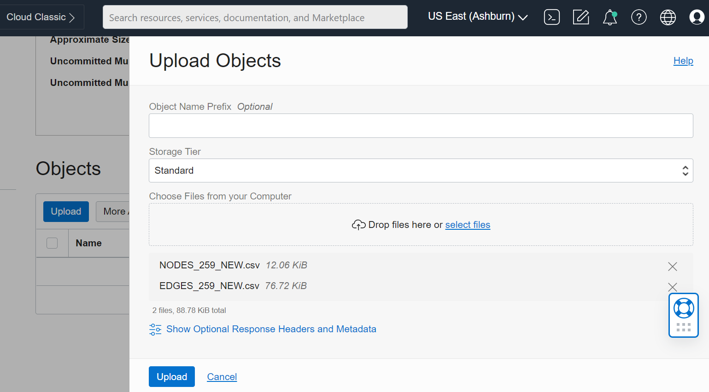
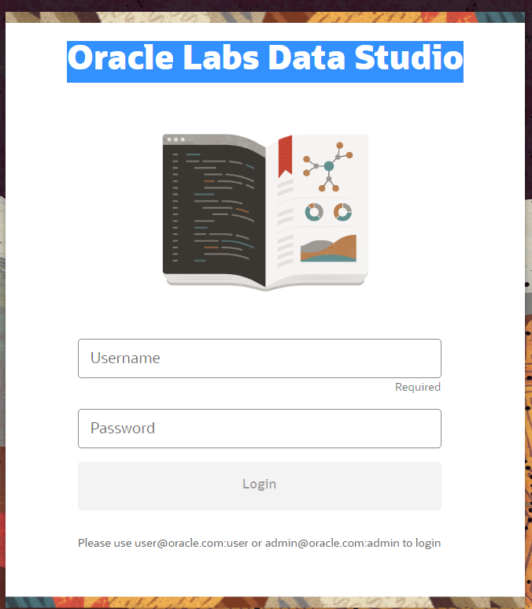
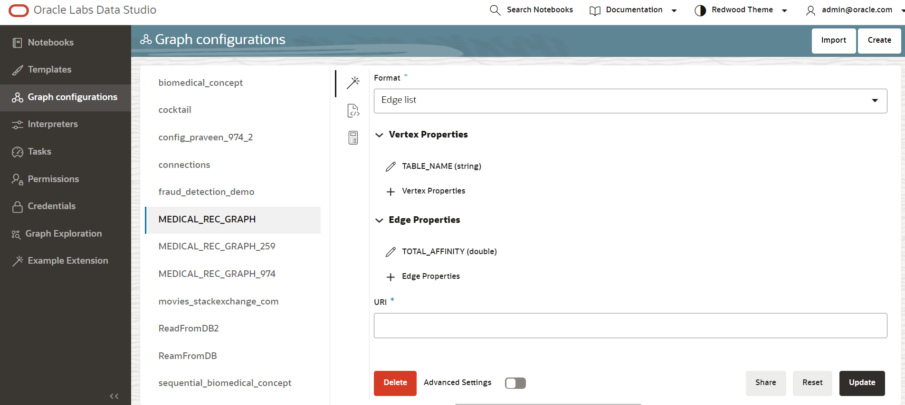
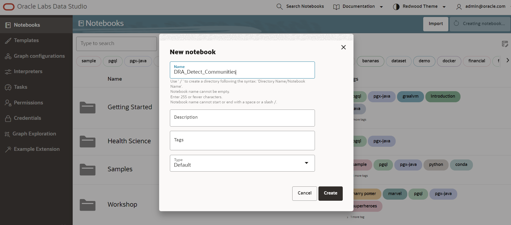
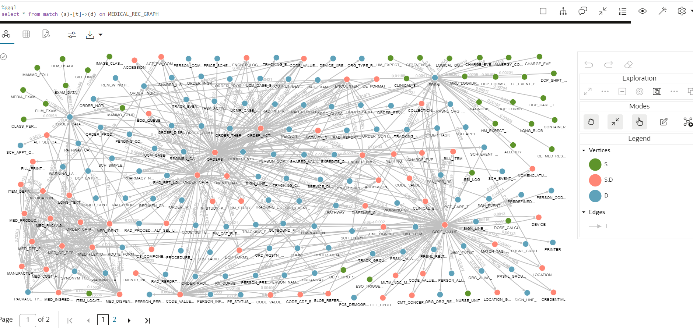

# Run the community detection algorithm

## Introduction

In this lab, using the graphs which are created in the previous labs, we applied the community detection algorithm which identifies the communities within the graphs. The community detection algorithm takes the input graphs and identities strong connectivity within graphs and forms multiple smaller communities. Infomap is used for community detection in this lab.

Estimated Lab Time: 15 minutes

### Objectives

In this lab, you will:
* create a graph in Data Studio
* Detect the communities using the Infomap.

### Prerequisites

This lab assumes you have:

* All previous labs were completed successfully.

## Task 1: Create the Bucket in OCI Compartment.
	
1. Login to OCI
2. Navigate to Storage in Menu
3. Select Object Storage & Archive Storage 
4. Select Buckets

	

2. Select the compartment and Click on Create Bucket
	
	
	
3. Enter Bucket Name and Click Create
	
		
	

## Task 2: Upload the CSV files of NODES and EDGES in OCI Buckets

1. Select the bucket and click on upload

  
  
2. Drag and Drop the Nodes and Edges files and click on Upload

  

## Task 3: Load the Graph Configuration

1. Login to Oracle Labs Data Studio.
   
   
2. 
   Create a file with below content and import it in graph configuration

	~~~
	{
    "format": "csv",
    "vertex_props": [
        {
            "name": "TABLE_NAME",
            "type": "string"
        }
    ],
    "edge_props": [
        {
            "name": "TOTAL_AFFINITY",
            "type": "double"
        }
    ],
    "vertex_id_strategy": "keys_as_ids",
    "edge_id_strategy": "keys_as_ids",
    "vertex_id_type": "string",
    "partition_while_loading": "no",
    "loading": {
        "create_edge_id_index": true,
        "create_edge_id_mapping": true
    },
	
    "vertex_uris": [
        "https://objectstorage.us-ashburn-1.oraclecloud.com/n/maacloud/b/bucket-medical-recs-csv/o/NODES_259_NEW.csv"
    ],
    "edge_uris": [
        "https://objectstorage.us-ashburn-1.oraclecloud.com/n/maacloud/b/bucket-medical-recs-csv/o/EDGES_259_NEW.csv"
    ],
    "vertex_id_column": "TABLE_NAME",
    "edge_id_column": "TABLE_MAP_ID",
    "edge_source_column": "TABLE1",
    "edge_destination_column": "TABLE2",
    "header": true
	}
	~~~
	Replace values for "vertex_uris" and "edge_uris" with newly uploaded csv files.

	Save this as MEDICAL_REC_GRAPH.json file.

	Upload this json file in graph configurations.

	
	
## Task 3: Detect the communities using Infomap

1. create the new Notebook
   

	Create new paragraph and add below code and run the paragraph
	~~~
	%pgx-java
	PgxGraph graph = session.readGraphWithProperties(MEDICAL_REC_GRAPH, "MEDICAL_REC_GRAPH");
	~~~
	Output: Lists the number of Nodes and Edges in the Graph. Here its 259 Nodes and 972 Edges
	~~~
	PgxGraph[name=MEDICAL_REC_GRAPH,N=259,E=972,created=1663935475498]
	~~~
2. Visualize the input graph 

	~~~
	%pgql
	select * from match (s)-[t]->(d) on MEDICAL_REC_GRAPH
	~~~
	Output : 
	
	
3. Run the Infomap to find the communities within the small graph
	~~~
	%pgx-java
	EdgeProperty<Double> weight = graph.getEdgeProperty("TOTAL_AFFINITY");
	VertexProperty<Integer, Double> rank = analyst.weightedPagerank(graph, 1e-16, 0.85, 1000, true, weight);
	VertexProperty<Integer, Long> module = graph.createVertexProperty(PropertyType.LONG);

	Partition<Integer> promise = analyst.communitiesInfomap(graph, rank, weight, 0.15, 0.0001, 100, module);
	VertexCollection<Integer> first_component = promise.getPartitionByIndex(0)

	out.println("Res : " + first_component)
	out.println("Total number of identified Clusters  : " + promise.size())
	for (VertexCollection<Integer> partition : promise){
		out.println("===================================");
		out.println("There are "+ partition.size()+" Nodes in this below Cluster");
		for (PgxVertex<Integer> vertexInCommunity : partition){
			out.println("Node : " + vertexInCommunity.getId());
		}
	}
	~~~
	Output :
	~~~
	Total number of identified Clusters  : 32
	===================================
	There are 1 Nodes in this below Cluster : 
	Node : CODE_SET_EXTENSION
	===================================
	There are 1 Nodes in this below Cluster : 
	Node : BILL_ITEM_MODIFIER
	===================================
	There are 1 Nodes in this below Cluster : 
	Node : DEVICE_XREF
	===================================
	There are 1 Nodes in this below Cluster : 
	Node : DISCRETE_TASK_ASSAY
	===================================
	There are 63 Nodes in this below Cluster : 
	Node : ALLERGY
	Node : ALLERGY_COMMENT
	Node : CE_EVENT_ACTION
	Node : CE_EVENT_PRSNL
	Node : CE_MED_RESULT
	Node : CHARGE_EVENT
	Node : CHARGE_EVENT_ACT
	Node : CHARGE_EVENT_ACT_PRSNL
	Node : CLINICAL_EVENT
	Node : CONTAINER
	Node : DCP_CARE_TEAM_PRSNL
	Node : DCP_FORMS_ACTIVITY
	Node : DCP_FORMS_ACTIVITY_PRSNL
	Node : DCP_SHIFT_ASSIGNMENT
	Node : DIAGNOSIS
	Node : ESI_LOG
	Node : HM_EXPECT_MOD
	Node : HM_EXPECT_MOD_HIST
	Node : LOGICAL_DOMAIN
	Node : LONG_BLOB
	Node : MRU_LOOKUP_ED_DOC
	Node : NOMENCLATURE
	Node : PAT_ED_DOC_ACTIVITY
	Node : PAT_ED_FAVORITES
	Node : PAT_ED_RELTN
	Node : PAT_ED_SHORTCUT
	Node : PERSON
	Node : PERSON_COMBINE_DET
	Node : PERSON_NAME
	Node : PM_TRANSACTION
	Node : PM_WAIT_LIST_STATUS
	Node : PPR_CONSENT_POLICY
	Node : PPR_CONSENT_STATUS
	Node : PRIV_LOC_RELTN
	Node : PROBLEM
	Node : PROBLEM_COMMENT
	Node : PROBLEM_PRSNL_R
	Node : PROC_PRSNL_RELTN
	Node : PRSNL
	Node : RAD_PROTOCOL_ACT
	Node : RAD_PROTOCOL_DEFINITION
	Node : RAD_REPORT_PRSNL
	Node : RAD_RES_INFO
	Node : RAD_TECH_CMT_DATA
	Node : REACTION
	Node : SCD_STORY
	Node : SCD_TERM_DATA
	Node : SCH_ENTRY
	Node : SCH_EVENT_ACTION
	Node : SCH_LOCATION
	Node : SCH_LOCK
	Node : SCR_PATTERN
	Node : STICKY_NOTE
	Node : TASK_ACTIVITY_ASSIGNMENT
	Node : TRACKING_CHECKIN
	Node : TRACKING_EVENT_HISTORY
	Node : TRACKING_EVT_CMT
	Node : TRACKING_ITEM
	Node : TRACKING_LOCATOR
	Node : TRACKING_PRSNL
	Node : TRACKING_PRV_RELN
	Node : TRACK_REFERENCE
	Node : V500_EVENT_SET_EXPLODE
	===================================
	There are 1 Nodes in this below Cluster : 
	Node : DRC_PREMISE
	===================================
	There are 1 Nodes in this below Cluster : 
	Node : EXPEDITE_COPY
	===================================
	There are 1 Nodes in this below Cluster : 
	Node : PERSON_PRSNL_ACTIVITY
	===================================
	There are 1 Nodes in this below Cluster : 
	Node : IMAGE_CLASS_TYPE
	===================================
	There are 43 Nodes in this below Cluster : 
	Node : BILL_ITEM
	Node : BLOB_REFERENCE
	Node : CMT_CONCEPT
	Node : CMT_CONCEPT_EXTENSION
	Node : CODE_CDF_EXT
	Node : CODE_VALUE
	Node : CODE_VALUE_ALIAS
	Node : CODE_VALUE_EXTENSION
	Node : CODE_VALUE_GROUP
	Node : CODE_VALUE_SET
	Node : CREDENTIAL
	Node : DCP_FORMS_ACTIVITY_COMP
	Node : DEPT_ORD_STAT_SECURITY
	Node : DEVICE
	Node : DISPENSE_CATEGORY
	Node : DOSE_CALCULATOR_UOM
	Node : ENCNTR_INFO
	Node : ESO_TRIGGER
	Node : FILL_CYCLE_BATCH
	Node : LOCATION_GROUP
	Node : MATCH_TAG_PARMS
	Node : MLTM_NDC_MAIN_DRUG_CODE
	Node : NURSE_UNIT
	Node : ORDER_TASK
	Node : ORD_RQSTN_ORD_R
	Node : ORG_BARCODE_FORMAT
	Node : ORG_BARCODE_ORG
	Node : PCS_DEMOGRAPHIC_FIELD
	Node : PERSON_ALIAS
	Node : PERSON_CODE_VALUE_R
	Node : PERSON_INFO
	Node : PERSON_PERSON_RELTN
	Node : PE_STATUS_REASON
	Node : PREDEFINED_PREFS
	Node : PRSNL_ALIAS
	Node : PRSNL_GROUP
	Node : PRSNL_GROUP_RELTN
	Node : PSN_PPR_RELTN
	Node : SIGN_LINE_FORMAT
	Node : SIGN_LINE_FORMAT_DETAIL
	Node : TRACK_GROUP
	Node : V500_EVENT_SET_CODE
	Node : WORKING_VIEW_FREQ_INTERVAL
	===================================
	There are 15 Nodes in this below Cluster : 
	Node : CLINICAL_SERVICE_RELTN
	Node : ENCNTR_PRSNL_RELTN
	Node : ENCOUNTER
	Node : LOCATION
	Node : ORGANIZATION
	Node : ORG_ALIAS_POOL_RELTN
	Node : PCT_CARE_TEAM
	Node : PERSON_PRSNL_RELTN
	Node : PHONE
	Node : PRSNL_ORG_RELTN
	Node : PRSNL_RELTN
	Node : PRSNL_RELTN_ACTIVITY
	Node : SCH_APPT
	Node : SCH_EVENT
	Node : SCH_EVENT_ALIAS
	===================================
	There are 1 Nodes in this below Cluster : 
	Node : OCS_FACILITY_R
	===================================
	There are 1 Nodes in this below Cluster : 
	Node : ORDER_TASK_XREF
	===================================
	There are 1 Nodes in this below Cluster : 
	Node : ORG_ORG_RELTN
	===================================
	There are 1 Nodes in this below Cluster : 
	Node : ORG_TYPE_RELTN
	===================================
	There are 1 Nodes in this below Cluster : 
	Node : OUTBOUND_FIELD_PROCESSING
	===================================
	There are 1 Nodes in this below Cluster : 
	Node : PFT_ENCNTR
	===================================
	There are 23 Nodes in this below Cluster : 
	Node : ALT_SEL_CAT
	Node : ALT_SEL_LIST
	Node : FILL_PRINT_ORD_HX
	Node : ITEM_DEFINITION
	Node : ITEM_LOCATION_COST
	Node : LONG_TEXT
	Node : MANUFACTURER_ITEM
	Node : MEDICATION_DEFINITION
	Node : MED_COST_HX
	Node : MED_DEF_FLEX
	Node : MED_DISPENSE
	Node : MED_FLEX_OBJECT_IDX
	Node : MED_IDENTIFIER
	Node : MED_INGRED_SET
	Node : MED_OE_DEFAULTS
	Node : MED_PACKAGE_TYPE
	Node : MED_PRODUCT
	Node : ORDER_CATALOG_ITEM_R
	Node : PACKAGE_TYPE
	Node : QUANTITY_ON_HAND
	Node : RX_CURVE
	Node : WARNING_LABEL
	Node : WARNING_LABEL_XREF
	===================================
	There are 1 Nodes in this below Cluster : 
	Node : PRINTER
	===================================
	There are 1 Nodes in this below Cluster : 
	Node : PROC_CLASSIFICATION
	===================================
	There are 1 Nodes in this below Cluster : 
	Node : PROXY_GROUP
	===================================
	There are 1 Nodes in this below Cluster : 
	Node : SHARED_VALUE_GTTD
	===================================
	There are 1 Nodes in this below Cluster : 
	Node : ROUTE_FORM_R
	===================================
	There are 1 Nodes in this below Cluster : 
	Node : RAD_INIT_READ
	===================================
	There are 1 Nodes in this below Cluster : 
	Node : PRIVILEGE
	===================================
	There are 1 Nodes in this below Cluster : 
	Node : RAD_REPORT_DETAIL
	===================================
	There are 1 Nodes in this below Cluster : 
	Node : RES_SIGN_ACT_SUBTYPE
	===================================
	There are 88 Nodes in this below Cluster : 
	Node : ACCESSION
	Node : ACCESSION_ORDER_R
	Node : ACTIVITY_DATA_RELTN
	Node : ACT_PW_COMP
	Node : BILL_ONLY_PROC_RELTN
	Node : CODE_VALUE_EVENT_R
	Node : COLLECTION_PRIORITY
	Node : CS_COMPONENT
	Node : ECO_QUEUE
	Node : ENCNTR_ALIAS
	Node : ENCNTR_LOC_HIST
	Node : EXAM_DATA
	Node : FILM_EXAM
	Node : FILM_USAGE
	Node : ICLASS_PERSON_RELTN
	Node : IMAGE_CLASS
	Node : IM_STUDY
	Node : IM_STUDY_PARENT_R
	Node : MAMMO_FOLLOW_UP
	Node : MAMMO_STUDY
	Node : MEDIA_EXAM
	Node : NETTING
	Node : OE_FORMAT_FIELDS
	Node : ORDERS
	Node : ORDER_ACTION
	Node : ORDER_CATALOG
	Node : ORDER_CATALOG_SYNONYM
	Node : ORDER_COMMENT
	Node : ORDER_CONTAINER_R
	Node : ORDER_DETAIL
	Node : ORDER_DISPENSE
	Node : ORDER_ENTRY_FIELDS
	Node : ORDER_INGREDIENT
	Node : ORDER_INGREDIENT_DOSE
	Node : ORDER_IV_INFO
	Node : ORDER_LABORATORY
	Node : ORDER_NOTIFICATION
	Node : ORDER_PRODUCT
	Node : ORDER_PRODUCT_DOSE
	Node : ORDER_RADIOLOGY
	Node : ORDER_REVIEW
	Node : ORDER_SENTENCE
	Node : ORDER_SUPPLY_REVIEW
	Node : ORDER_TASK_RESPONSE
	Node : ORDER_THERAP_SBSTTN
	Node : OUTPUT_DEST
	Node : PATHWAY
	Node : PATHWAY_CATALOG
	Node : PENDING_COLLECTION
	Node : PERSON_COMBINE
	Node : PHARMACY_NOTES
	Node : PRICE_SCHED
	Node : PROCEDURE_SPECIMEN_TYPE
	Node : PW_CAT_FLEX
	Node : PW_CAT_SYNONYM
	Node : RAD_EXAM
	Node : RAD_FILM_ADJUST
	Node : RAD_FOLLOW_UP_CONTROL
	Node : RAD_FOLLOW_UP_RECALL
	Node : RAD_FOL_UP_FIELD
	Node : RAD_INT_CASE
	Node : RAD_INT_CASE_R
	Node : RAD_PRIOR_PREFS
	Node : RAD_PROCEDURE_ASSOC
	Node : RAD_PROCEDURE_GROUP
	Node : RAD_REPORT
	Node : RAD_RPT_LOCK
	Node : REGIMEN_CATALOG
	Node : REGIMEN_CAT_SYNONYM
	Node : RENEW_NOTIFICATION_PERIOD
	Node : SCH_APPT_OPTION
	Node : SCH_APPT_ORD
	Node : SCH_EVENT_ATTACH
	Node : SCH_EVENT_PATIENT
	Node : SCH_SIMPLE_ASSOC
	Node : SERVICE_DIRECTORY
	Node : SHARED_LIST_GTTD
	Node : SIGN_LINE_DTA_R
	Node : TASK_ACTIVITY
	Node : TASK_DISCRETE_R
	Node : TASK_RELTN
	Node : TEMPLATE_NONFORMULARY
	Node : TRACKABLE_OBJECT
	Node : TRACKING_EVENT
	Node : TRACK_EVENT
	Node : UCMR_CASE_TYPE
	Node : UCM_CASE
	Node : UCM_CASE_STEP
	===================================
	There are 1 Nodes in this below Cluster : 
	Node : SYNONYM_ITEM_R
	===================================
	There are 1 Nodes in this below Cluster : 
	Node : TRACKING_EVENT_ORD
	===================================
	There are 1 Nodes in this below Cluster : 
	Node : TRACKING_PRSNL_REF
	===================================
	There are 1 Nodes in this below Cluster : 
	Node : DCP_ENTITY_RELTN
	~~~

## Learn More

## Acknowledgements
* **Author** - Praveen Hiremath, Developer Advocate
* **Contributors** -  Praveen Hiremath, Developer Advocate
* **Last Updated By/Date** - Praveen Hiremath, Developer Advocate, September 2022 

